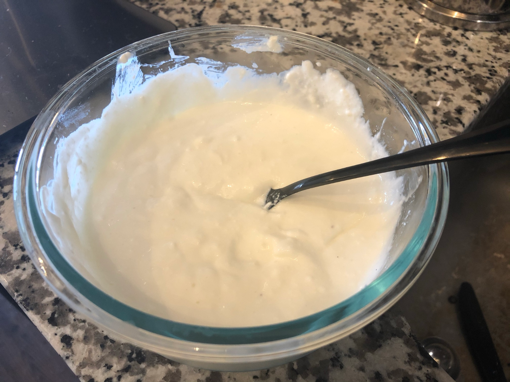

## My adventures in making skyr

### What is skyr?

Skyr is an Icelandic type of yogurt (I've also heard that it's technically a cheese, though I forget why; regardless, you eat it like yogurt).
It's tasty, very thick, and has way more protein and helpful bacteria than most yogurt.

### Why am I making it?

1) I like it (see "It's tasty" and the health benefits) and making it is cheaper than buying it.

2) Simple recipe: Heat milk, cool milk, add some skyr as a starter (much like sourdough starter), keep warm and then refrigerate.

3) Deceptively hard to get right!
I'll talk about that more below.
Obviously, I didn't know this when I first started.

4) I love self-feeding recipes!
They're so cool.
I don't have a sourdough starter going, because I don't want to commit to making it regularly, but my plan is to make a new batch of skyr each week; this should only be a commitment of about 30 minutes of active work, as it's mostly waiting.

5) Iceland is high up (probably #1, really) on my list of countries I'd like to visit if this pandemic ever ends.

### Story time! Why's it deceptively hard?

As I write this, I'm in the process of maybe, if I had to guess, my 8th attempt at making skyr at home.
I've had two moderate successes, in that the last two batches have seemed to allow the bacteria to proliferate and the end result tasted pretty much like Siggi's (the one brand of skyr that my grocery store carries, which I've been eating with lunch during quarantine and using as my starter).
However, both batches turned out with a texture more like cottage cheese than thick yogurt.
Since it's not a particularly popular food outside of Iceland, it's hard to find guidance on problems like this.
(Big shoutout to /u/Bignezzy on Reddit, whose [post](https://www.reddit.com/r/Iceland/comments/g414eq/made_some_lemon_flavored_skyr/) on /r/Iceland is where I learned about skyr in the first place and who helped me get my first semi-successful batch.)
So for the batch I'm working on now, I've turned to [this yogurt troubleshooting guide](https://www.kitchenstewardship.com/homemade-yogurt-troubleshooting-guide/) in hopes that my texture problem is the same.
What I'm doing differently this batch, based on that guide, is keeping a much closer eye on the temperature during the skyr's rest peroid.

Now would be a good time to take an aside and talk first about my "setup" as it were, and second about my recipe.

My pot for heating the milk is a 6-quart stainless steel stock pot.
It's much larger than necessary for the amount I make in one batch (1 liter of milk), but the only other pot I own was starting to leave mysterious black flakes in it, so here we are.
(Plus, the very large surface area to volume ratio of this pot does help reduce the variance in temperature of the milk.)
I've got a ceramic stovetop, for what that's worth, but I don't think that changes much about skyr making.
And finally, to keep the skyr warm while it's resting, I use [this adorable crock pot](https://www.etsy.com/listing/277217756/vintage-rival-crock-ette-1-quart-slow), or one much like it (mine is one my family has had ever since I can remember, but if it's not this exact model it's a very very similar one).
A few notable qualities of this crock pot: it's small (the 1 liter of milk I use fills it almost to the brim), it has no temperature control (it's either plugged in or it's off), and, seriously, look how cute it is.
I've found its temperature without the lid to be about 120°F.
Finally, I'm using the [Thermapen Mk4](https://www.thermoworks.com/Thermapen-Mk4) as my thermometer.
Yes, I realize that that's an insane amount of money to spend on a thermometer, but Alton Brown said that that was his reaction too but that it really is worth it.
I'm not yet convinced that it was worth what I spent, but I also haven't used it for much besides skyr yet.

As far as my current, semi-successful recipe goes, it's sort of a combination of the recipe /u/Bignezzy put in the comments of the post linked above and the recipe I found [here](https://icelandmag.is/article/make-your-own-skyr).
I use a liter of whole milk (many of my failed attempts used skim; this was a suggestion of /u/Bignezzy), and otherwise pretty much follow the first recipe.
As I write this, I'm realizing that I'd been meaning to use the ratio of milk to starter from the second recipe, but accidentally have been using twice that.
That will be something to fix for next time.
The rennet was another suggestion that fixed problems I was having.
[This](https://cheesemaking.com/products/liquid-animal-rennet/?variant=8059863334957) is the rennet I use.
As I understand it, you're supposed to dilute it with water; I've been using the quantites I used to [test my rennet](https://cheesemaking.com/blogs/learn/faq-rennet-for-cheese-making) (.5tsp rennet in .5C water) and that's seemed to work fine.

So, getting back to story time, you've probably noticed that three things I've mentioned are related: that this time I'm going to keep a closer eye on the skyr's resting temperature, that my crockpot's one temperature is 120°F, and that the recipe says to keep it at 110°F for 4 hours.
In my last batch, I checked the temperature about half an hour after I first put it in the crock pot and it was still around 110°, but I checked again after the 4 hours and it had climbed all the way to 135°!
So my plan this time is to check the temperature every half hour or so and if it's above 115°, unplug the crockpot.
The skyr seems to hold heat pretty well (I suspect that's why it got so far above 120° in the first place), so I'll leave the crock pot unplugged until the next time I check it and then, likely, plug it back in and repeat until the 4 hours are up.

That's about all I have for now, other than that I'd like to quickly describe some of my failed attempts.
I tried a few times to follow more closely the second recipe, and went through several combinations of it and the first recipe.
Each time, it refused to "set" and by the time I was done, it was still just milk with some store-bought skyr mixed in.
I made the switch from skim to whole milk in the same batch that I started using rennet, so I can't say for sure which change solved the "setting" problem, but some combination of those changes did it.
The one failed batch I've had since making that switch was just me forgetting to let the milk cool to 110° before I put it in the crock pot with the rennet and starter skyr.
That batch did set (again into the same cottage cheese texture I'm trying to fix now), but tasted pretty awful and pretty unlike what skyr should taste like.
Would not recommend.

### Update 2020/09/29

The last batch turned out with the cottage cheese texture as well 😢
I have several new things to try for next time though.
First (as mentioned in the OP), there's fixing the ratio of milk to starter.
Second, when I was checking the temperature of the skyr as it rested, it warmed to 130° much faster than I expected.
It was still around 110° when I checked it after the first half hour, but by the next check, it was already up to 130°!
I think next time, I'll let the crock pot get up to 110° before I transfer the skyr, then unplug it once I do and leave it like that with the lid on.
Then I'll check the temperature and plug it in (for much less than half an hour, maybe 10 minutes or so) only when it needs to get back up to 110°.
I think the rennet and the skyr bacteria should be fine down to 90° or so, but I'll try to keep it in the 100-110° range.
The last thing I will change for next time is how I separate the curds.
I've been straining it with a cheesecloth as soon as I take it off of its resting heat, but after looking up what a yogurt strainer is, I think I might be supposed to let it chill and strain at the same time.

(Endnote to this update: I think this is probably how I'll continue to update this post, leaving the OP intact and appending updates as I experiment with new batches (at least until I get to a point where I can consistently get everything right, after which I'll probably do a lot of restructuring))

### Update 2020/10/04

Well, I made a mistake that I'd already made: I forgot to let it cool from 180° to 110° before mixing in the starter and rennet.
I'm going to try and salvage it by letting that mixture cool to 110° and then adding it to some starter and rennet that haven't been ruined, but I don't have high hopes.
I should leave myself a note above my stove next time to not do this.

#### Addendum 2020/10/05

As expected, yesterday's batch didn't turn out.
I also messed up trying to drain it, but I know how not to next time.
I've been using a nut milk bag as my cheesecloth, but from the side (i.e. not using it as a bag, but just as two layers of cloth).
Next time, I'm going to actually use it like a bag.
This will mean I only get one layer of cloth, but it will make it much easier to manage with the pouring and whatnot.
Also, a glimmer of hope!
While most of the batch was still cottage cheese-textured, I did spot some nontrivial yogurt-textured parts!
I think my new approach to maintaining temperature is showing some promise (I did notice it up to 115° at one point; I'll be more careful next time).
If I actually do everything according to plan next time, I think my first fully-successful batch is nigh.

### Update 2020/10/19

Oh, how wonderful to have found success.
I had some of yesterday's batch with lunch today and it was (mostly) great.
There was a bit of a sour aftertaste that was only noticeable after a few bites, but which did end up being a little unpleasant by the end.
I don't know why I suspect this, but I think it might have something to do with the little bit of whey that I added back in to thin it out after it had strained overnight.
(Really, I don't think it needed any thinning at all and I'll probably skip that next time, but the second recipe linked mentioned that it's something you can do, so I tried it.)
Tomorrow, I plan on adding a little bit more sugar (right now as far as "additives" go, it has 1T of sugar and 2 drops of vanilla extract; this is the same ratio of vanilla : skyr as /u/Bignezzy's recipe, with half the sugar : skyr ratio).
But the texture was much smoother and yogurt-like, almost identical to Siggi's.
I'll add pictures later; I have both pre- and post-mixing pictures, but they only exist on my phone right now.
I do think mixing in the sugar and vanilla turned the texture more liquid; I didn't eat any before I mixed it up (which was a pretty thorough whisking with a fork), but it definitely looked more solid and yogurt-like.

As for next steps, besides fixing the minor issues above, I have a few things still I want to do.
The first is simply feeding another batch with this current one; in theory, it should "just work," but that's far from a guarantee of smooth sailing.
The second thing is getting a proper yogurt strainer.
What I ended up doing to simulate one involved pretty extensive rearranging of my fridge, including removing an entire shelf.
(I should have taken a picture of this, too, come to think of it.
I basically had the bag tied up and hanging from my fridge's bottle rack, above a bowl sitting in my vegetable drawer.)
I don't think there's another way to do it in my fridge, so yogurt strainer it is.
Finally, I want to "productionalize" my process, if you will.
By this I mean that every step that was dependent on a specific temperature was mostly done by trail-and-error timing (e.g. go check if it's time to turn the stove up yet, check if the milk has cooled down yet, check if the crock pot needs to be plugged back in for a few minutes, etc.).
Ideally, I'd like to just know how long things take, so I could manage the entire process with a series of timers and be entirely hands-off for even longer.
As I figure this out, I'll certainly continue logging my attempts here (in Gantt chart form, probably), but I'm not sure if they'll be much use to anyone besides myself; different stoves heat at different speeds, modern crock pots have more control mechanisms than the power cord, etc.
But they'll be useful for me as I dial in the times, and if they do happen to be useful to others, all the better.

I will post an addendum tomorrow with pictures and my findings about adding more sugar!

### Update 2021/01/01

How meaningful is the difference between "tomorrow" and "next year" anyways?

I had every intention of actually making this post on 2020/10/20, but then I didn't... And then I didn't on the 21st either, or the 22nd, and you get the picture.
I'm fairly sure I didn't make any more skyr in 2020 after that last update; if I did, it was just the following Sunday.
Mostly, I stopped because the holidays were coming up, the League of Legends World Championship was in full swing (and in China, so it was tanking my sleep schedule pretty hard), and it seemed likely that I would miss a week sooner or later due to some craziness or other.
The bad news about putting off this update for several months is that I do not remember at all whether the extra added sugar affected the sour aftertaste.
The good news is that I do still have the pictures!

Before mixing:

After mixing:

I do plan on getting back to this now that it's a new year and there isn't much that I can see coming that would derail my weekly cadence.
So probably, new post on 2021/01/03 or 04.
(Also, I have a real yogurt strainer now.)

### Update 2021/01/04

Well, I thought I did everything right yesterday, but the soupy, cottage-cheese-textured skyr in my fridge disagrees.
I did have a few close calls with temperatures (I accidentally let the milk fall past 105° after getting it to 180° and it dipped down to around 95° in the crock pot a couple of times), but they seemed like they shouldn't've ruined it.
Whether that was the issue or not, a pass through the cheesecloth before it goes into the yogurt strainer seems to be necessary.
A fair amount of whey filtered down to the bottom part of the strainer, but there was also clearly some left on top of the curds even after it had been sitting in there for right around 24 hours.
I did strain it through the cheese cloth just before I mixed the vanilla extract and sugar in, and I'm letting it chill in the fridge for another day with that extra whey gone to see if that helps, but I'm not hopeful.
Maybe I'll try again tomorrow morning, ahead of schedule, since I had been planning to use some in a recipe this coming weekend.
We shall see.

### Update 2021/01/21

In fact, I did end up trying again on the morning of 2021/01/05, making about a three-fourths recipe (as that's all the milk I had).
However, I put it in the refrigerator later on in the day to strain, checked it in the morning of the sixth before going to the office\*, and when I got back, I was too distracted for several days by the insurrection at the capitol to do anything more with it.
I plan to try again this coming Sunday.

\* I've been going to the office on a roughly monthly cadence, since it's near the store I get cat food from, and a bag of cat food lasts about a month.
The office is still mostly empty, and I don't think I've been within ten feet of anyone any time I've gone in.
Everyone wears masks.
I think the risk of catching or spreading COVID-19 while I'm there is acceptably low for this monthly frequency.

